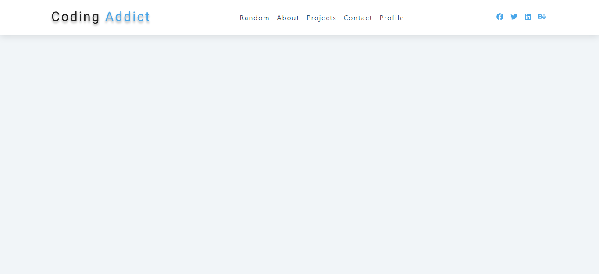
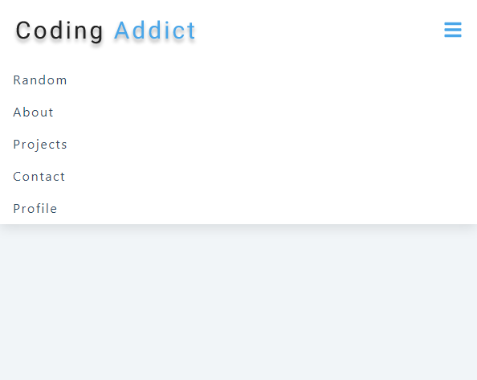

#### Homepage

[view](https://femi-ologunwa.github.io/11-react-navbar-project)

[mobile view](https://femi-ologunwa.github.io/11-react-navbar-project)

### Implementation

-  Illustrating use of useRef hook
-  Adjusting the height of mobile links container based on the number of links
