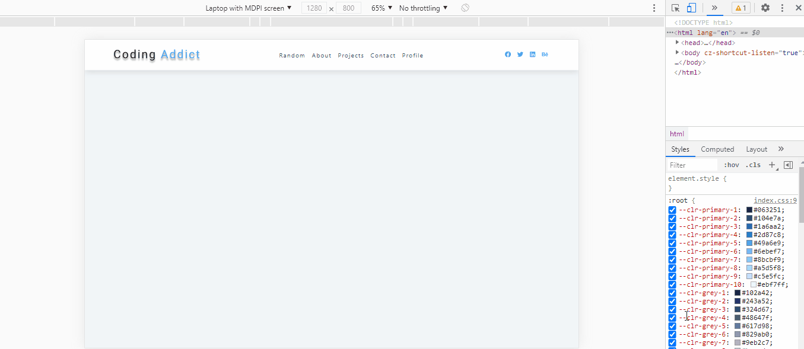

#### React Responsive Navbar

[view page ](https://femi-ologunwa.github.io/11-react-navbar-project)

### Implementation

-  Illustrating use of `useRef` hook to select an element
-  Modifyng the propeties of an element selected with the `useRef` hook
-  Implement how to dynamically change the height of a component on the screen by using `useEffect`, `useRef` and `getBoundingClientRect()`;
